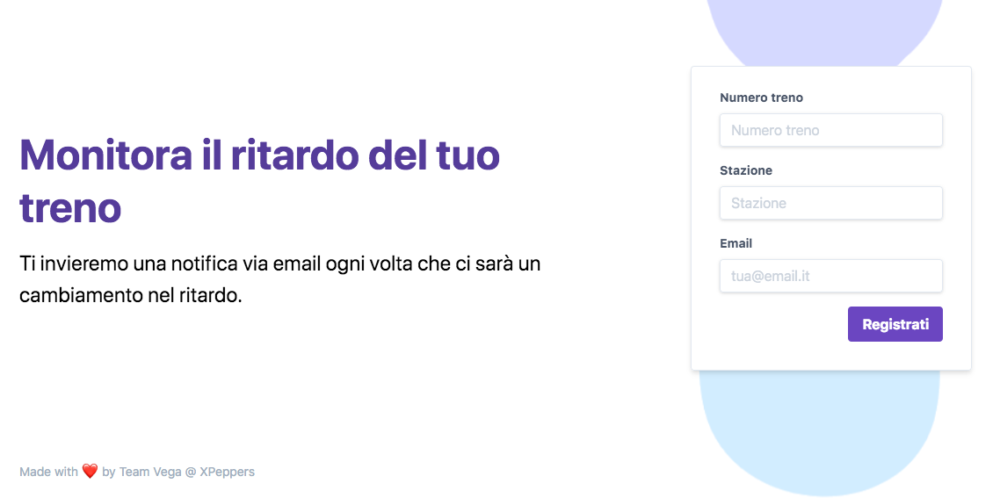

# Timetableless

A delay tracker for trains in Italy.
Powered by Serverless framework.

DEMO: [development](http://timetableless-dev.s3-website-eu-west-1.amazonaws.com/) , [production](http://timetableless-pro.s3-website-eu-west-1.amazonaws.com/)

---

---

## Usage

### Get delay alerts for your train

Simply provide the train number for your train, the station at which you want to take it, and your email where to receive notifications.
If the registration is successful, you will receive an email alert every time the delay of your train changes.

### Delete your registration

If you don't want to receive any more alerts, you can click on the unregister link at the bottom of alert emails.

## Development

### Requirements

To run this project locally, your system must meet the following requirements:

* be a unix-like system
* nodejs
* a working JRE (for dynamodb-local)

### Setup your local environment

```
npm install
npm run install:dynamodb
```

### Start all services locally

You'll need to launch both the API and the frontend.

API

```
npm start
```

Frontend

```
npm run start:client
```

### Test

By default it runs Unit and Integration Tests

```
npm t
```

Run only unit tests

```
npm run test:unit
```

Run only integration tests

```
npm run test:integration
```

Run only acceptance tests

```
npm run test:acceptance
```

Test coverage

```
npm run coverage
```

## Deploy to AWS

Setup aws credentials and then run

```
npm run deploy
```

### AWS Infrastructure Requirements

This project assumes that your account has been moved out of the Amazon SES sandbox.

## Tail on function logs
You can find functionName in the `serverless.yml` file

```
npm run logs -- -f <functionName> -t
```

## Trenitalia API documentation

https://github.com/bluviolin/TrainMonitor/wiki/API-del-sistema-Viaggiatreno
